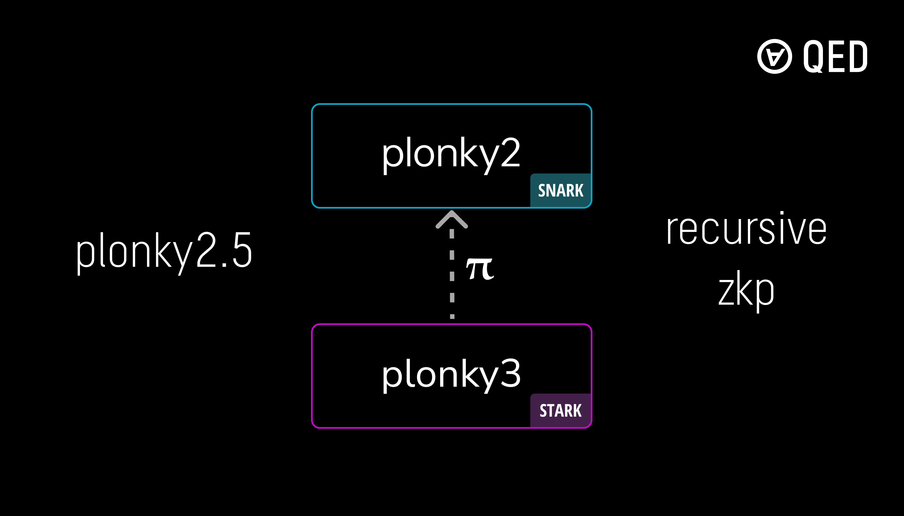

<p align="center"><a href="https://qedprotocol.com"></a></p>

<h1 align="center">plonky2.5</h1>

<hr/>  
<p align="center">
  verify <a href="https://github.com/Plonky3/Plonky3">plonky3</a> STARK proofs in a <a href="https://github.com/0xPolygonZero/plonky2">plonky2</a> SNARK
</p>


## Getting Started

Generate plonky3 fibonacci(64) proof
```
git clone -b fib-example https://github.com/QEDProtocol/plonky3-fibonacci
cd plonky3-fibonacci/keccak-air
cargo run --example prove_goldilocks_poseidon2_fibonacci
```

Clone this repo and copy the generated proof to `src/p3/`
```
cd ...
git clone https://github.com/QEDProtocol/plonky2.5
cd plonky2.5
cp ../plonky3-fibonacci/keccak-air/proof_fibonacci.json src/p3/
```

Verify a plonky3 fibonacci proof in a plonky2 proof
```
cargo test --release --package plonky2_5 --lib -- 'p3::tests::test_verify_plonky3_proof' --exact --nocapture
```

### Todo
- Add link to plonky3 proof generation code
- Add tutorial for AIR setup
- Add custom gate for poseidon2 (URGENT)


## License
Copyright 2024 Zero Knowledge Labs Limited

Permission is hereby granted, free of charge, to any person obtaining a copy of this software and associated documentation files (the “Software”), to deal in the Software without restriction, including without limitation the rights to use, copy, modify, merge, publish, distribute, sublicense, and/or sell copies of the Software, and to permit persons to whom the Software is furnished to do so, subject to the following conditions:

The above copyright notice and this permission notice shall be included in all copies or substantial portions of the Software.

THE SOFTWARE IS PROVIDED “AS IS”, WITHOUT WARRANTY OF ANY KIND, EXPRESS OR IMPLIED, INCLUDING BUT NOT LIMITED TO THE WARRANTIES OF MERCHANTABILITY, FITNESS FOR A PARTICULAR PURPOSE AND NONINFRINGEMENT. IN NO EVENT SHALL THE AUTHORS OR COPYRIGHT HOLDERS BE LIABLE FOR ANY CLAIM, DAMAGES OR OTHER LIABILITY, WHETHER IN AN ACTION OF CONTRACT, TORT OR OTHERWISE, ARISING FROM, OUT OF OR IN CONNECTION WITH THE SOFTWARE OR THE USE OR OTHER DEALINGS IN THE SOFTWARE.


Made with ❤️ by <a href="https://qedprotocol.com">QED</a>
